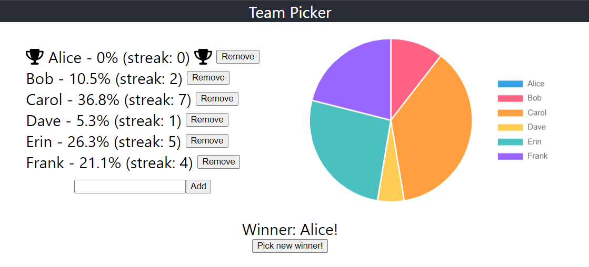

# Minimal Team Picker app

A SolidJS app for choosing a member of a team.

What it does:

- Add and remove team members.
- Pick a member of the team using a weighted random chance, depending on how many rounds it has been since that member was last picked. You cannot be picked twice in a row.
- Visualisation of the chance for each member to be picked next.

What it doesn't:

- Remember state between sessions

Uses:

- [SolidJS](https://solidjs.com), based on their [quick-start template](https://docs.solidjs.com/quick-start#for-typescript-projects) for [TypeScript](https://www.typescriptlang.org/) projects
- [Chart.js](https://www.chartjs.org/) via [solid-chartjs](https://github.com/s0ftik3/solid-chartjs)
- [FontAwesome](https://fontawesome.com/) via [solid-fontawesome](https://github.com/gnomical/solid-fontawesome)

## Screenshot



## Usage

```bash
$ npm install
```

### Learn more on the [Solid Website](https://solidjs.com) and come chat with us on our [Discord](https://discord.com/invite/solidjs)

## Available Scripts

In the project directory, you can run:

### `npm run dev` or `npm start`

Runs the app in the development mode.<br>
Open [http://localhost:3000](http://localhost:3000) to view it in the browser.

The page will reload if you make edits.<br>

### `npm run build`

Builds the app for production to the `dist` folder.<br>

## Deployment

You can deploy the `dist` folder to any static host provider (netlify, surge, now, etc.)
